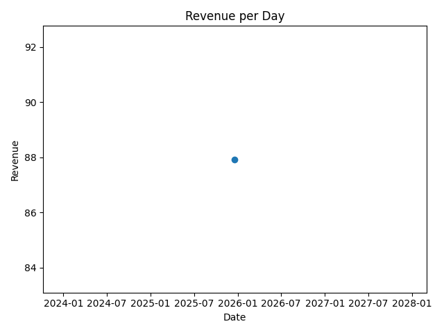
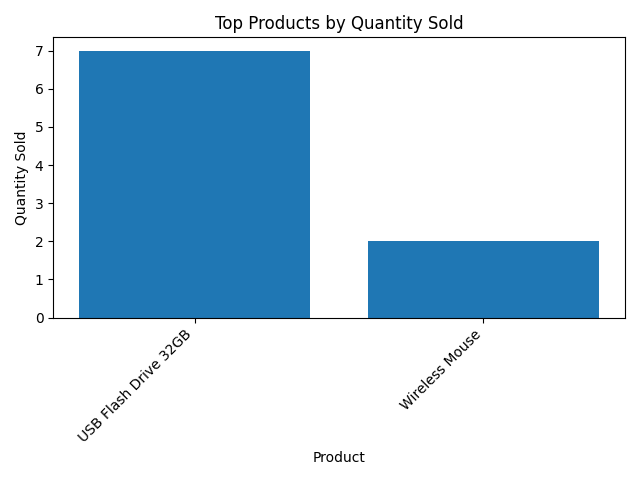

# Sales & Inventory System (Python + SQL)

A beginner-friendly project that combines **Python** and **SQL (SQLite)** to manage customers, products, orders, inventory, and basic analytics.

## Features
- Create and manage a SQLite database (`sales.db`)
- Customers and products tables
- Create orders and add order items safely (prevents duplicate rows)
- Process orders with transactions:
  - Updates stock
  - Calculates total amount
  - Prevents double-processing using a `processed` flag
- Print receipts (grouped items)
- Analytics:
  - Revenue per day
  - Top products by quantity sold
  - Top customers by spend
- Export CSV reports and save charts as PNG

## Project Structure

## Setup (Windows)
1. Clone/download the project
2. Create and activate a virtual environment:
```bash
python -m venv .venv
.venv\Scripts\activate
## Charts


